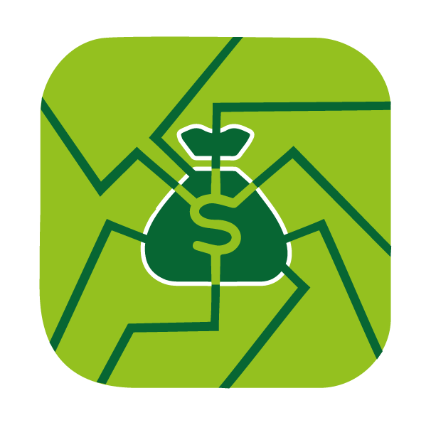

# 437-iWallet

# Idea Overview
Sharing a credit card is a bit complicated process with some restrictions especially on teen-agers, 
accompanied with some disadvantages such as losing the card, or the difficulty of creating one with the need of a Bank Account, being above 18 years old and the wideness of the information that one should provide to the bank. 
Looking at the banking system crisis in Lebanon, and the continuously diminishing trust in this sector came the idea of offering a financial centralized digital environment from a physical card to a one-click away transfer medium; or as we call it “iWallet”. 
The idea is similar to the Chinese application “WeChat” (1.2 billion users) or the locally hosted “Whish Money” app that provides close enough features. 
Our main concern remains in creating a virtual safe environment that enables easy P2P Transfer across users.  

# Description
Our app users will be able to deposit or withdraw money at iWallet headquarters.

The balance changes will be reflected in the corresponding accounts.  

In addition to the app main feature that provides money transfer, our app 
enables expenses and income visualizations and insights (graphs , bar 
plots, prediction using linear regression ) private to each user. 

Finally the user will be able to post bill reminders, in order to fetch upcoming  or overdue bills 

# iWallet Services
### Dashboard:
- User transactions
- User deposits and withdrawals
- User reminders
- Financial Analysis
### Bill Reminder:
- Record a transaction as a reminder. 
- The reminder could be set with an auto payment service so that it gets paid automatically when it's due. 
### Money Transfer:
- Peer to peer money transfer

# Implementation projections
- Displaying error handling on Front End
- Transactions verification by mail
- Improving ability of auto pay engine to check at a faster interval

